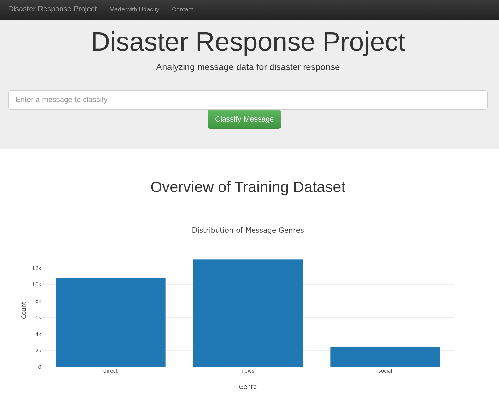

# Disaster Response Pipeline Project

### Summary
This repository contains a classification engine in a web app to identify how a message relates best to 36 different categories. The web app should look like this:

 

### Data set
There are two datasets in this repository.

1. messages.csv
The messages contains the our dependent variable. We want to be able to classify some message into 36 different categories. 

2. categories.csv
This data set contains the flagged categories, to train our model on. 

### Cleaning the data
We need to go through a few steps to make our data set usefull. 

The categories column is a string with this structure: "related-0;request-0;offer-0;aid_related-0;medi..."
Therefore we need to go through a couple steps:
1. Split the string between ";" and create separate columns per split out string
2. Collumn names need to be the string without the last two characters of the string
3. The value needs to be only the last character of the string

Finally we merge everything back together and drop the duplicates. 

### Instructions:
1. Run the following commands in the project's root directory to set up your database and model.

    - To run ETL pipeline that cleans data and stores in database
        `python data/process_data.py data/disaster_messages.csv data/disaster_categories.csv data/DisasterResponse.db`
    - To run ML pipeline that trains classifier and saves
        `python models/train_classifier.py data/DisasterResponse.db models/classifier.pkl`

2. Run the following command in the app's directory to run your web app.
    `python run.py`

3. Go to http://0.0.0.0:3001/
